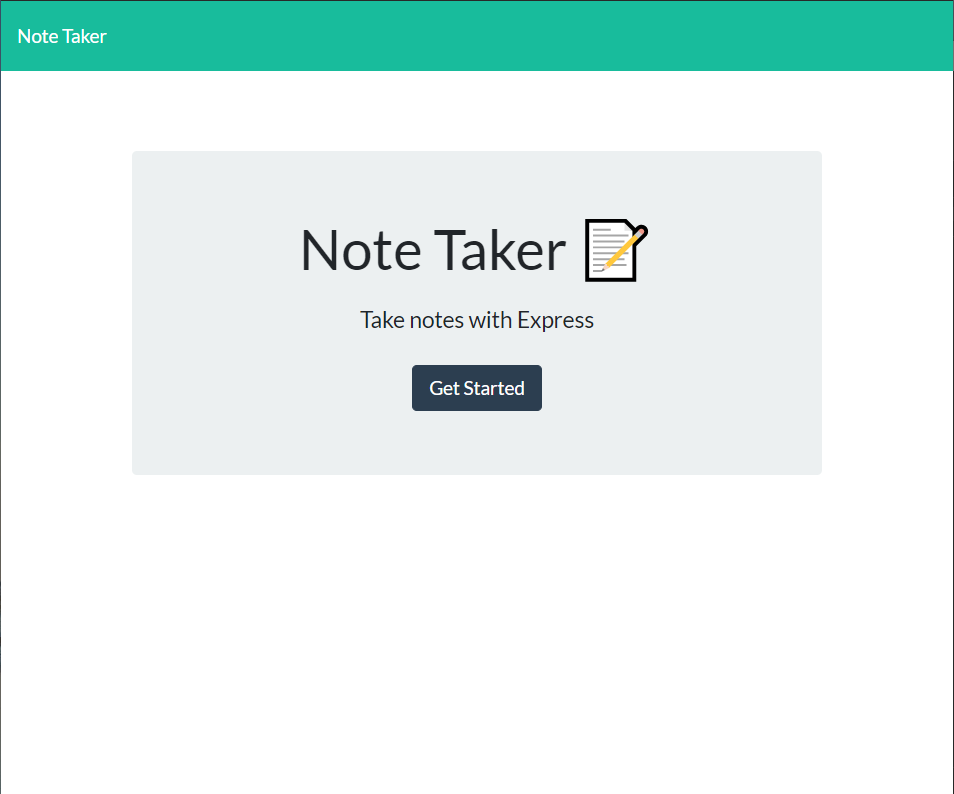
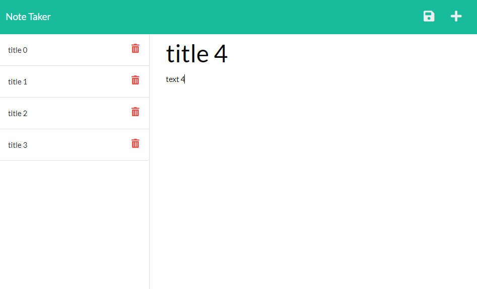
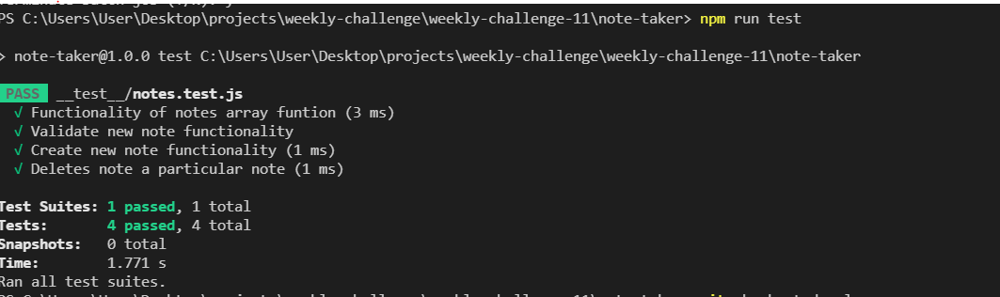

# Note Taker

## Description 

  Note Taker allows you to write and save notes so that you can organize your thoughts and keep track of tasks needed to be completed. Technologies/libraries used in this project were HTML,CSS, JavaScript, Node.js, express, jest.  

  - Deployed Link http://dkbaffour777-note-taker.herokuapp.com/
  
  
## Table of Contents
  
  
  * [Installation](#installation)
  * [Usage](#usage)
  
  * [Contributing](#contributing)
  * [Tests](#tests)
  * [Questions](#questions)
  

## Installation

  - Clone/Download the project
  - Run 'npm install' in the note-taker directory
  
## Usage 
  
  - Click the get started button
  - Use the text area to fill in your note details
  - Click the save button that appears on the top right to save your note
  - Use the delete icons to remove notes unwanted
  
  
  

  
  

## Contributing
  Please read the [Contributor Covenant](https://www.contributor-covenant.org/version/2/0/code_of_conduct/)

## Tests
  - Run 'npm run test'

  

## Questions
  - 👋 Hi, I’m dkbaffour777
  - GitHub profile link: [github.com/dkbaffour777/](https://github.com/dkbaffour777/)
  - 📫 How to reach, email: dkbaffour777@gmail.com
